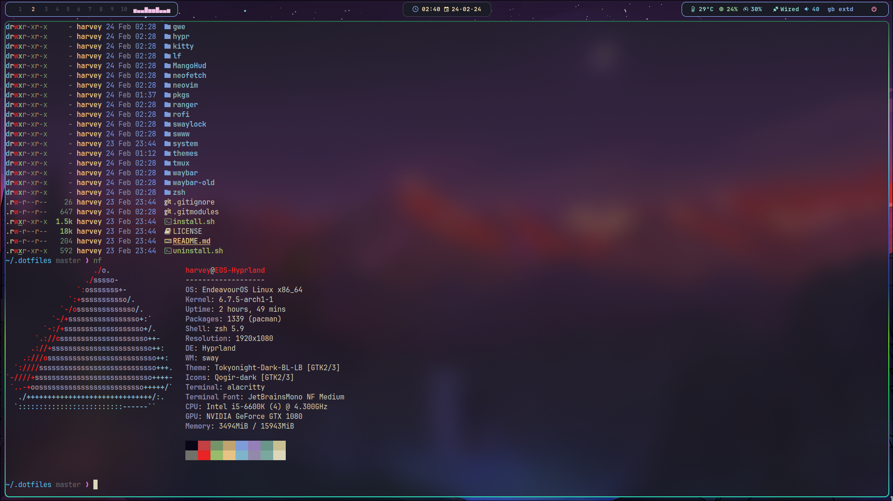

> [!Warning]
> <p>This repo is intended for my personal use.<br>
> I'm not responsible if you break anything!.</p>


## Install dotfiles

```bash
git clone https://github.com/Sly-Harvey/.dotfiles.git ~/.dotfiles && cd ~/.dotfiles && ./install.sh
```
> [!Note]
> To install my arch linux packages run the install script in pkgs/
> ```bash
> ./pkgs/install.sh
> ```
