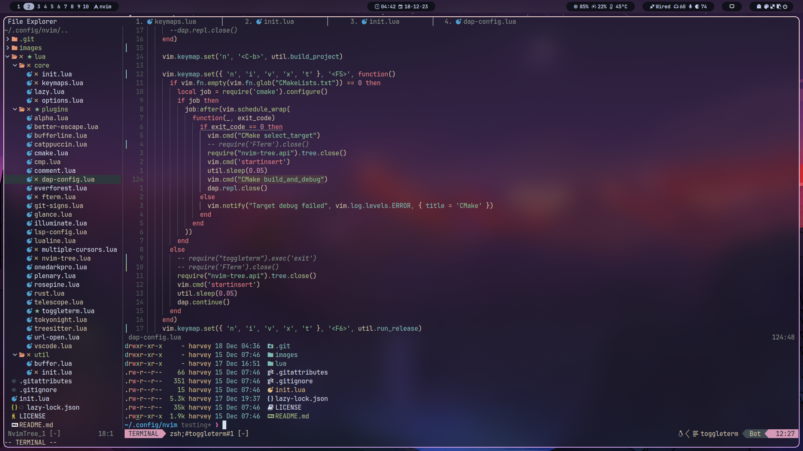
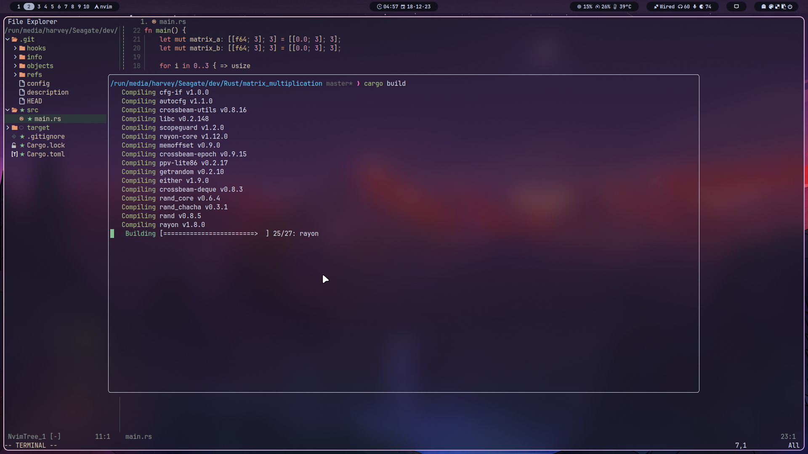

#  My neovim configuration

<a href="https://dotfyle.com/Sly-Harvey/nvim"></a>
<a href="https://dotfyle.com/Sly-Harvey/nvim"></a>
<a href="https://dotfyle.com/Sly-Harvey/nvim"></a>

For a full list of plugins, visit https://dotfyle.com/Sly-Harvey/nvim

**This config might be slow on windows because i mainly made it for linux and mac**




**Before installing, A nerd font is required to see all the icons inside neovim.**
**the nerd font that I recommend is [JetBrainsMono](https://github.com/ryanoasis/nerd-fonts/releases/download/v3.0.2/JetBrainsMono.zip)**

**To install on Linux/Mac, open terminal and then run the command below**
```command
rm -rf ~/.local/share/nvim && rm -rf ~/.config/nvim && git clone https://github.com/Sly-Harvey/nvim.git ~/.config/nvim
```

**To install on windows, open command prompt and then run the command below**
```bat
rmdir /S /Q %homepath%\appdata\local\nvim-data & rmdir /S /Q %homepath%\appdata\local\nvim & git clone https://github.com/Sly-Harvey/nvim.git %homepath%\appdata\local\nvim
```

## After installation
**Press Ctrl + b to build project.**

**Press F5 to run your project in debug mode.**

**Press Shift + F5 to terminate the debugging session.**

open neovim and run the command :Mason
This will open the Mason menu. Here you can install lsp servers which are required for language support such as auto completions.
You can install an lsp by highlighting an lsp from the list and press "i" to install it.
"cmake-language-server" for cmake, "Pyright" for python etc.
An extra tip if you want to uninstall an lsp you can press Shift + X on an lsp to uninstall it

**Hope you enjoy my configuration.**
